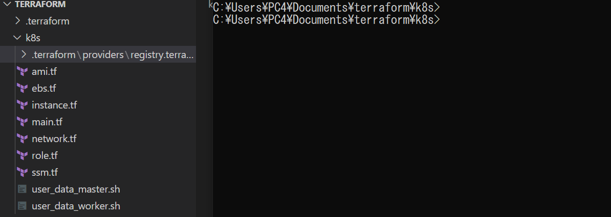
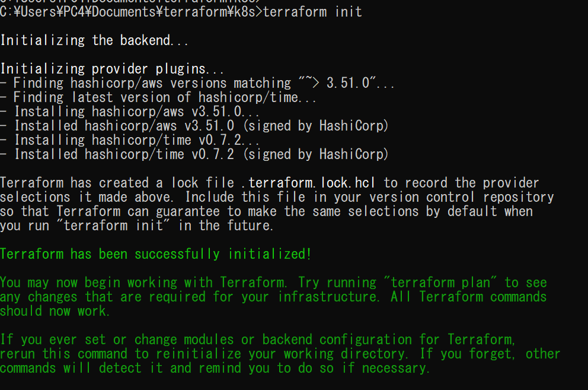

= terraform環境構築
:toc:
:sectnums:
:toclevels: 3
:toc-title: 目次

事前準備

* aws cliをインストール
* aws configureに認証情報を入れる

== terraformをインストール

https://docs.uipath.com/installation-and-upgrade/lang-ja/docs/installing-terraform

== terraform初期設定

terraformファイルが置いたディレクトリに移動

下記のコマンドを使って初期化する
----
terraform init
----

