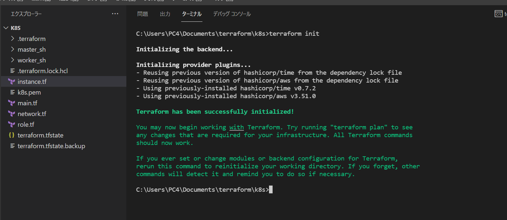
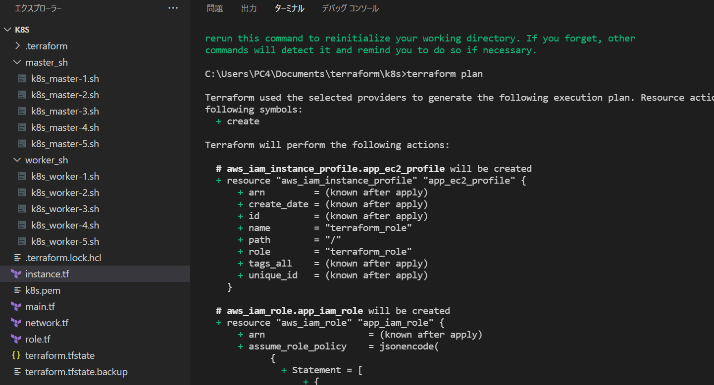
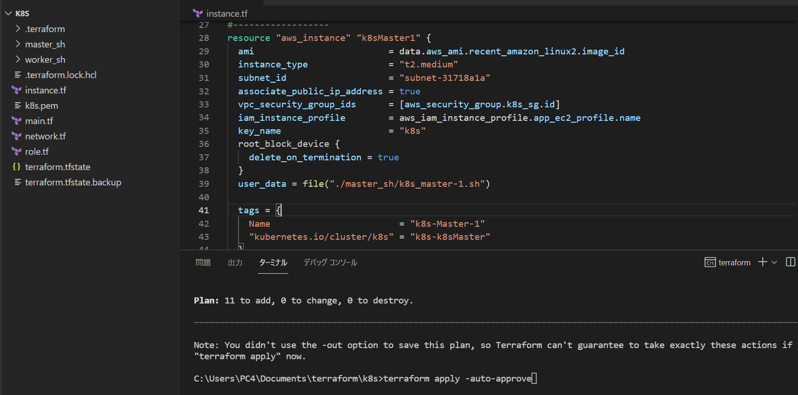
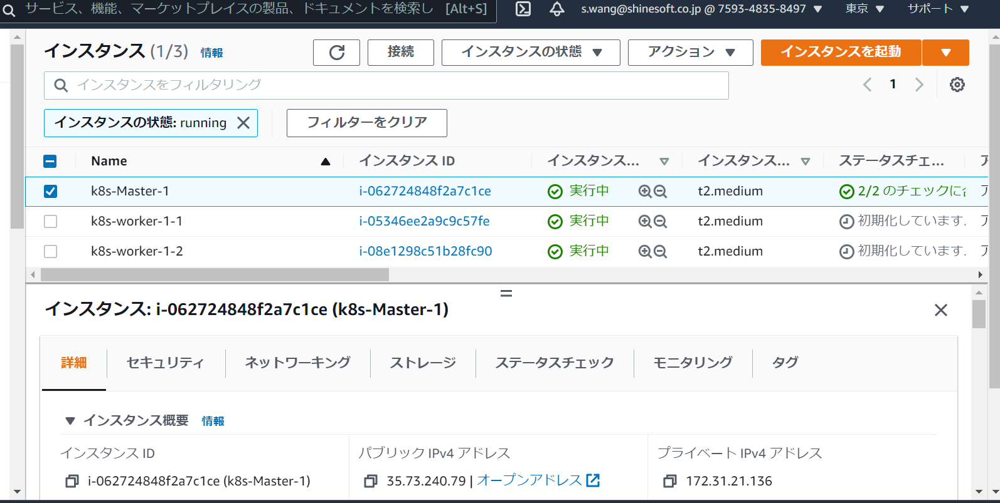
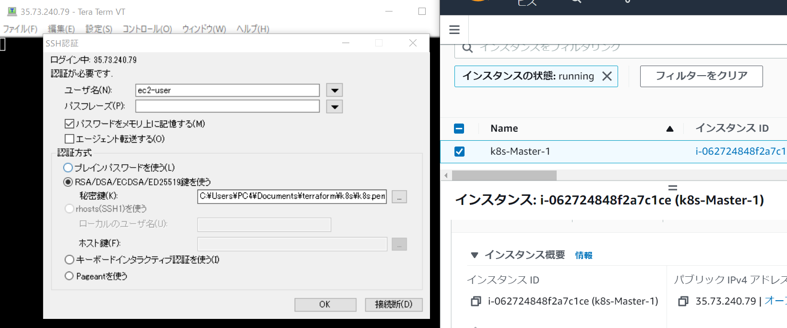
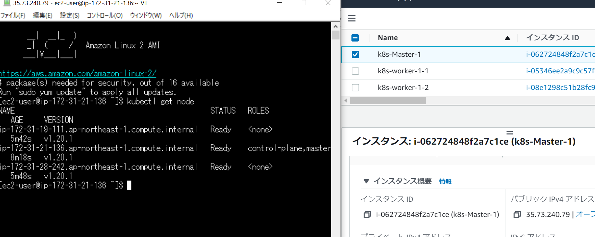

= terraformでAWSを使ってkubernetes環境を自動化
:toc:
:sectnums:
:toclevels: 3
:toc-title: 目次

事前準備

* aws cliをインストール
* aws configureに認証情報を入れる

== terraformをインストール

https://docs.uipath.com/installation-and-upgrade/lang-ja/docs/installing-terraform

== terraform初期設定

=== GitHubからk8sファイルをダウンロード

=== k8sファイルが置いているディレクトリに移動

下記のコマンドを使って初期化する
----
terraform init
----

== 動作確認

コマンドを使って作成するものを確認
----
terraform plan 
----

問題がなければ、コマンドを使って作成する

----
terraform apply -auto-approve
----

実行が終わったらAWS マネジメントコンソールにログインし、インスタントが作成されていることが確認できる

次に、masterノードに接続して、環境が自動化されていることを確認

== 環境削除

コマンドを使って作成したものを削除
----
terraform destroy -auto-approve
----

== カスタマイズ

現在の構成はmasterノード1つとworker2つですが、必要に応じてshellファイルとinstance.tfファイルを変更すれば柔軟に対応できる。

